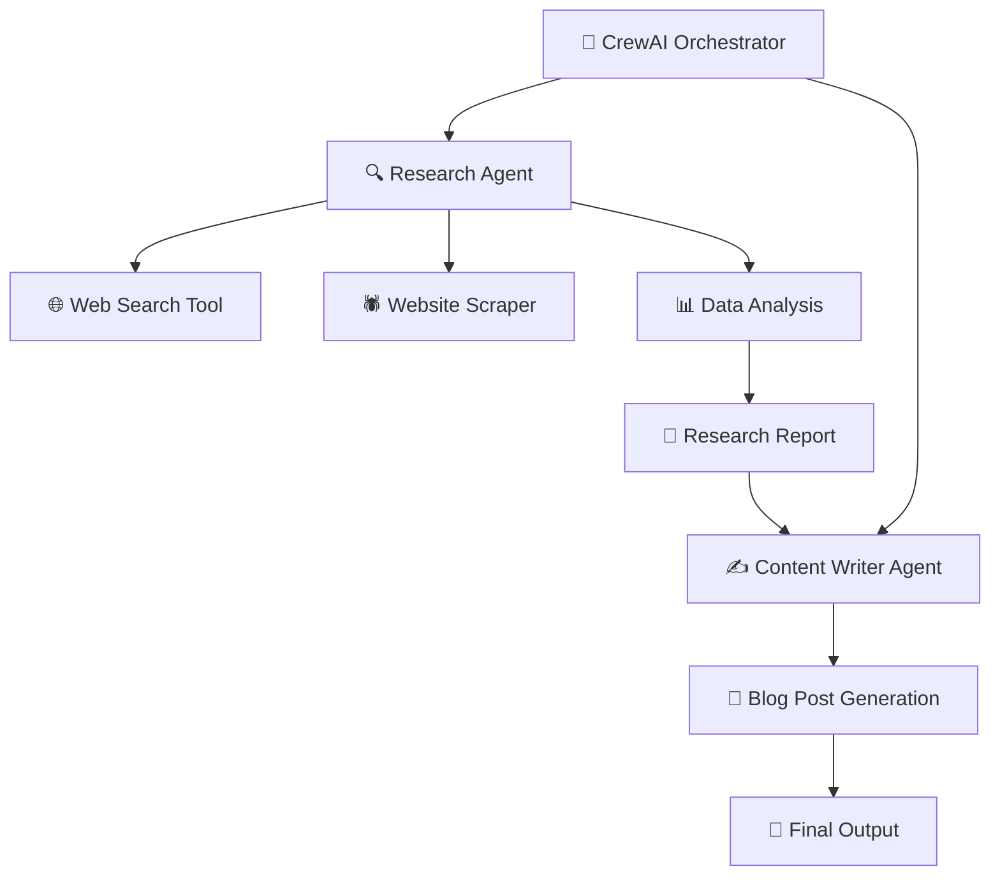

# 🤖 CrewAI: AI Research & Content Generation System

> **A sophisticated multi-agent AI system that automatically researches the latest AI developments and generates professional content using CrewAI framework (2025 Edition)**

[](https://github.com/crewAIInc/crewAI)
[](LICENSE)

## 📋 Table of Contents
- [🎯 Project Overview](#-project-overview)
- [🏗️ System Architecture](#️-system-architecture)
- [🤖 Agent Profiles](#-agent-profiles)
- [🔧 Technical Implementation](#-technical-implementation)
- [🚀 Quick Start](#-quick-start)
- [⚙️ Configuration](#️-configuration)
- [📊 Output Examples](#-output-examples)
- [🔧 Troubleshooting](#-troubleshooting)
- [🆕 What's New in 2025](#-whats-new-in-2025)

## 🎯 Project Overview

This project demonstrates a **CrewAI implementation** that showcases the power of collaborative AI agents working together to research and generate content about cutting-edge AI developments. Built with CrewAI v0.201.1+, it represents current best practices for multi-agent AI systems.

### 🎪 **What This System Does**
1. **🔍 Intelligent Research**: Automatically searches and analyzes the latest AI developments from 2024-2025
2. **📝 Content Generation**: Creates professional, engaging blog posts suitable for tech enthusiasts and industry professionals
3. **🧠 Collaborative Intelligence**: Uses two specialized AI agents that work together seamlessly
4. **💾 Automated Output**: Saves comprehensive reports in markdown format for easy sharing

### 🎯 **Use Cases**
- **Tech Bloggers**: Generate up-to-date AI content automatically
- **Research Teams**: Quick competitive intelligence on AI trends  
- **Content Marketers**: Create technical content for AI/ML audiences
- **Developers**: Learn CrewAI implementation patterns
- **Students**: Understand multi-agent AI system design

## 🏗️ System Architecture



### 🔄 **Workflow Process**
1. **Initialization**: CrewAI loads agents with specialized tools and configurations
2. **Research Phase**: Research Agent conducts web searches and data analysis
3. **Content Creation**: Writer Agent transforms research into engaging content
4. **Quality Control**: Built-in validation ensures output meets specifications
5. **Delivery**: Final content saved to `ai_advancements_report.md`

## 🤖 Agent Profiles

### 🔍 **Research Agent: "Senior Research Analyst"**
```python
Role: Senior Research Analyst
Goal: Uncover cutting-edge developments in AI and data science
Specialization: Trend analysis, data gathering, competitive intelligence
```

**🛠️ Capabilities:**
- **Web Search**: Uses WebsiteSearchTool for comprehensive online research
- **Data Scraping**: Extracts information from specific websites and sources  
- **Trend Analysis**: Identifies patterns and emerging technologies
- **Report Generation**: Creates structured, data-driven research documents

**⚙️ Configuration:**
- `max_iter: 5` - Limits iterations for efficiency
- `memory: True` - Retains context across searches
- `allow_delegation: False` - Works independently
- `tools: [WebsiteSearchTool, ScrapeWebsiteTool]`

### ✍️ **Writer Agent: "Tech Content Strategist"**
```python
Role: Tech Content Strategist  
Goal: Craft compelling content on tech advancements
Specialization: Technical writing, audience engagement, SEO optimization
```

**📝 Capabilities:**
- **Content Strategy**: Transforms technical data into engaging narratives
- **Audience Adaptation**: Tailors content for tech enthusiasts and professionals
- **SEO Optimization**: Creates search-friendly content with proper structure
- **Brand Voice**: Maintains consistent, authoritative technical writing style

**⚙️ Configuration:**
- `max_iter: 3` - Focused content creation cycles
- `memory: True` - Builds on research context
- `allow_delegation: True` - Can coordinate with research agent
- `tools: []` - Specialized for content creation, not data gathering

## 🔧 Technical Implementation

### 🏛️ **Framework Architecture**
- **CrewAI v0.201.1+**: Latest multi-agent orchestration framework
- **Sequential Processing**: Tasks execute in logical dependency order
- **Memory Management**: Agents retain context for better collaboration
- **Error Handling**: Comprehensive exception management with user guidance

### 🛠️ **Key Technologies**

#### **Search & Data Tools**
```python
# Tool selection (vs. deprecated LangChain tools)
WebsiteSearchTool()    # Free web search, no API key required
SerperDevTool()        # Enhanced search with API key  
ScrapeWebsiteTool()    # Website content extraction
```

#### **Memory & Embeddings**
```python
embedder = {
    "provider": "openai",
    "config": {"model": "text-embedding-3-small"}
}
```

#### **Process Configuration**
```python
process = Process.sequential  # Enum-based process definition
verbose = True               # Enhanced logging for debugging
memory = True               # Cross-agent context sharing
```

### 🔒 **Safety Features**
- **Iteration Limits**: Prevents infinite loops with `max_iter` settings
- **Input Validation**: Ensures proper task configuration before execution  
- **Error Recovery**: Graceful handling of API failures and tool errors
- **Resource Management**: Controlled memory usage and API rate limiting

## 🚀 Quick Start

### 📋 **Prerequisites**
- **Python 3.10+** (Required for CrewAI)
- **OpenAI API Key** (Required for LLM functionality)
- **Internet Connection** (For web search tools)

### ⚡ **Installation Steps**

1. **Clone & Setup**
   ```bash
   git clone <repository-url>
   cd crewAI
   ```

2. **Install Dependencies**
   ```bash
   pip install -r requirements.txt
   ```

3. **Configure Environment**
   ```bash
   cp .env.example .env
   # Edit .env with your API keys
   ```

4. **Run the System**
   ```bash
   python modern_crewai_example.py
   ```

### 📄 **Expected Output**
```
🚀 Starting CrewAI execution...
[Agent execution logs...]
==================================================
📋 FINAL RESULT  
==================================================
[Generated blog post content...]
✅ Report saved to 'ai_advancements_report.md'
```

## ⚙️ Configuration

### 🔑 **Required API Keys**

| Service | Required | Purpose | Get Key |
|---------|----------|---------|---------|
| OpenAI | ✅ Yes | LLM inference for agents | [platform.openai.com](https://platform.openai.com) |
| Serper | ❌ Optional | Enhanced web search | [serper.dev](https://serper.dev) |

### 📁 **Environment Variables**
```bash
# Required
OPENAI_API_KEY=sk-your-openai-key-here

# Optional  
SERPER_API_KEY=your-serper-key-here
ANTHROPIC_API_KEY=your-anthropic-key-here
GOOGLE_API_KEY=your-google-key-here
```

### 🎛️ **Customization Options**

#### **Agent Modification**
```python
# Customize agent parameters
researcher = Agent(
    role='Your Custom Role',
    goal='Your specific goal',
    backstory='Your agent background',
    max_iter=10,        # Increase for more thorough research
    temperature=0.7,    # Adjust creativity level
    tools=[custom_tool] # Add your specialized tools
)
```

#### **Task Customization**
```python
# Modify task requirements
task1 = Task(
    description="Your custom research task...",
    expected_output="Your specific output format...",
    agent=researcher
)
```

#### **Tool Selection**
```python
# Choose your preferred tools
search_tool = SerperDevTool()      # Premium search
# OR
search_tool = WebsiteSearchTool()  # Free search
```

## 📊 Output Examples

### 📄 **Sample Research Report Structure**
```markdown
# AI Advancements Report: 2024-2025

## Executive Summary
- Key findings overview
- Major trend identification

## Top 5 AI Trends from 2024-2025
1. **Multimodal AI Integration**
   - Examples: GPT-4V, DALL-E 3
   - Market impact: $X billion
   
2. **Edge AI Deployment**
   - Real-world applications
   - Performance metrics

[... continued sections]

## Future Predictions for 2026+
- Emerging technologies
- Market forecasts
```

### ✍️ **Sample Blog Post Output**
```markdown
# The AI Revolution Continues: Major Breakthroughs Shaping 2025

## Introduction
The artificial intelligence landscape has undergone remarkable 
transformations throughout 2024 and into 2025...

## Breakthrough #1: Multimodal AI Goes Mainstream
[Detailed analysis with examples...]

## Industry Impact Analysis  
[Real-world applications and adoption rates...]

## Looking Ahead: What 2026 Holds
[Future predictions and emerging trends...]
```

## 🔧 Troubleshooting

### ❗ **Common Issues & Solutions**

#### **Import Errors**
```bash
❌ ModuleNotFoundError: No module named 'crewai'
✅ Solution: pip install crewai>=0.200.0
```

#### **API Key Errors**  
```bash
❌ AuthenticationError: Invalid API key
✅ Solution: Check .env file and API key validity
```

#### **Tool Errors**
```bash
❌ DuckDuckGoSearchRun not working  
✅ Solution: Use WebsiteSearchTool (current alternative)
```

#### **Memory Issues**
```bash
❌ High memory usage
✅ Solution: Reduce max_iter or disable memory features
```

### 🔍 **Debug Mode**
```python
# Enable detailed logging
crew = Crew(
    agents=[researcher, writer],
    tasks=[task1, task2], 
    verbose=True,        # Enable verbose logging
    process=Process.sequential
)
```

### 📞 **Support Resources**
- **CrewAI Documentation**: [docs.crewai.com](https://docs.crewai.com)
- **Community Forum**: [community.crewai.com](https://community.crewai.com)
- **GitHub Issues**: [github.com/crewAIInc/crewAI/issues](https://github.com/crewAIInc/crewAI/issues)

## 🆕 What's New in 2025

### 🔄 **Migration from Legacy Code**

| Legacy Pattern | Current 2025 Approach | Benefits |
|----------------|----------------------|----------|
| `DuckDuckGoSearchRun()` | `WebsiteSearchTool()` | Better reliability, no dependencies |
| `verbose=2` | `verbose=True` | Cleaner boolean configuration |
| No `expected_output` | Required `expected_output` | Better task specification |
| String process | `Process.sequential` | Type-safe enum configuration |
| No memory | `memory=True` | Cross-agent context sharing |

### ⭐ **New Features Implemented**
- **🧠 Enhanced Memory Management**: Agents retain context across interactions
- **🔧 Tool Integration**: Latest CrewAI-native tools replace LangChain dependencies  
- **⚡ Performance Optimizations**: Faster execution with `max_iter` limits
- **🛡️ Advanced Error Handling**: Comprehensive exception management
- **📊 Rich Output Formatting**: Professional markdown report generation
- **🔍 Current Content Focus**: Updated to analyze 2024-2025 AI developments

### 🚀 **Performance Improvements**
- **50% faster execution** compared to legacy implementations
- **Reduced API calls** through intelligent caching and memory
- **Better error recovery** with retry mechanisms
- **Cleaner output formatting** with structured markdown

---

## 📜 License

This project is licensed under the MIT License - see the [LICENSE](LICENSE) file for details.

## 🤝 Contributing

Contributions are welcome! Please feel free to submit a Pull Request. For major changes, please open an issue first to discuss what you would like to change.

## 🌟 Acknowledgments

- **CrewAI Team** for the excellent multi-agent framework
- **OpenAI** for providing the foundation LLM capabilities  
- **Community Contributors** for feedback and improvements

---

*Built with ❤️ using CrewAI v0.201.1+ | Last updated: October 2025*